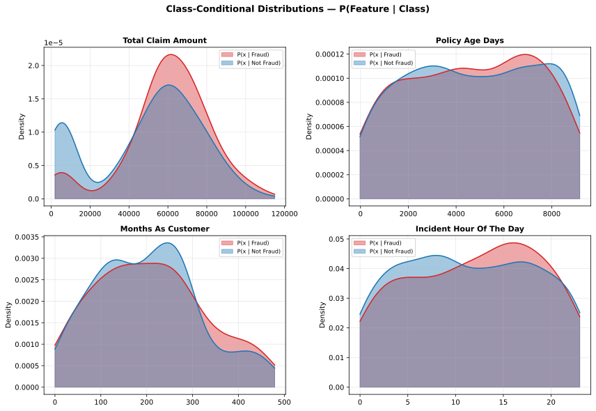
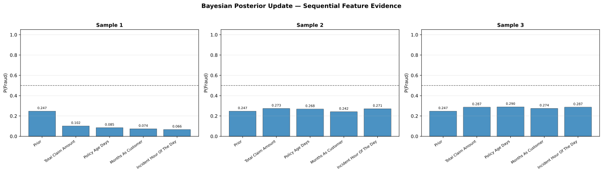
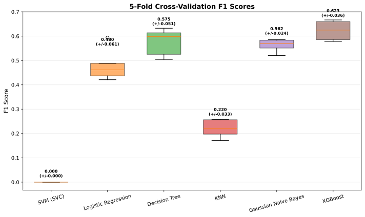
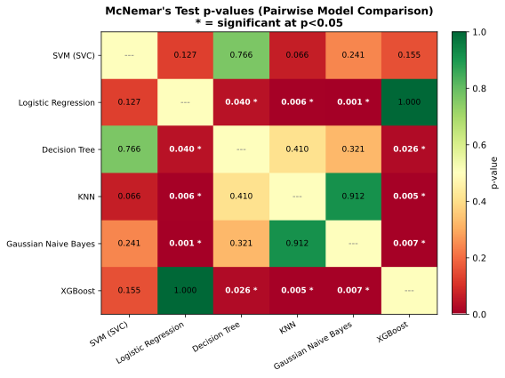
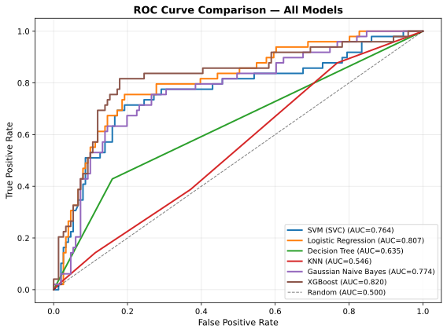
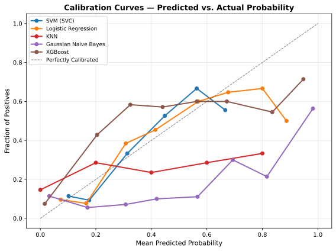
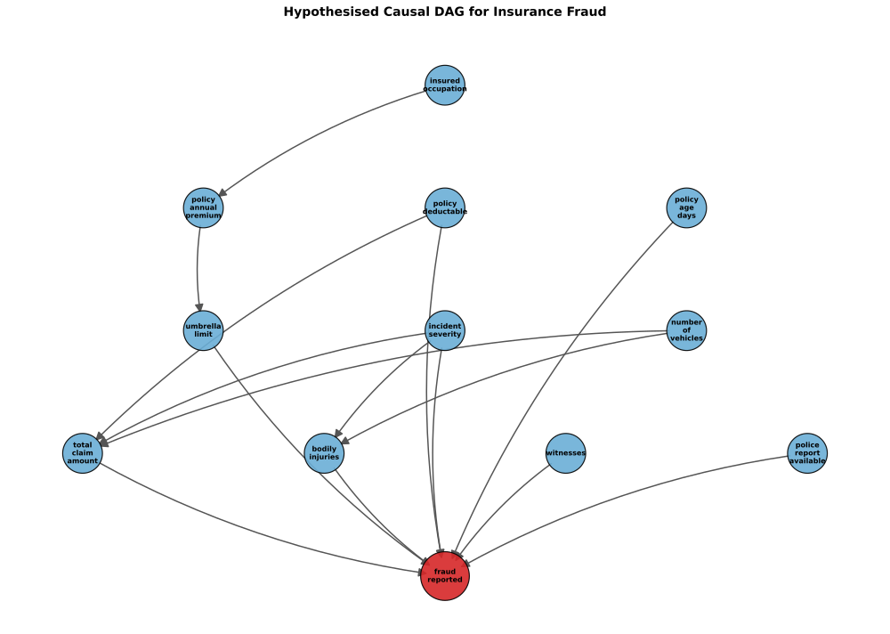
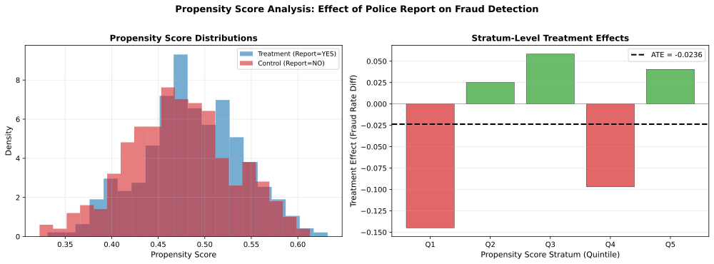
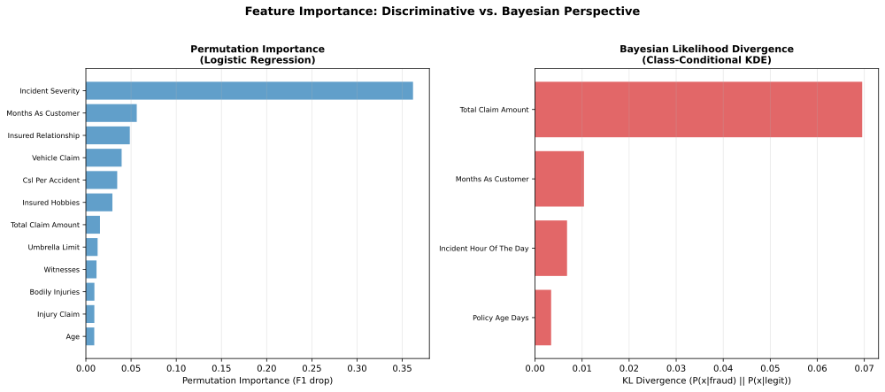

# Insurance Fraud Detection — Advanced Analysis Report

## 1. Dataset Overview

- **Source:** `insurance fraud claims.csv`
- **Total samples:** 1000
- **Train / Test split:** 800 / 200 (80:20 stratified)
- **Features after preprocessing:** 54
- **Base fraud rate (prior):** 0.247
- **Missing values:** `collision_type` (178), `property_damage` (360), `police_report_available` (343) — imputed with most-frequent

## 2. Model Performance Summary

| Model | Accuracy | Precision | Recall | F1-Score | ROC-AUC |
|-------|----------|-----------|--------|----------|---------|
| SVM (SVC) | 0.7550 | 0.0000 | 0.0000 | 0.0000 | 0.7758 |
|  **Logistic Regression** | 0.8350 | 0.6667 | 0.6531 | 0.6598 | 0.8275 |
| Decision Tree | 0.7750 | 0.5476 | 0.4694 | 0.5055 | 0.6718 |
| KNN | 0.6950 | 0.2500 | 0.1224 | 0.1644 | 0.5208 |
| Gaussian Naive Bayes | 0.6450 | 0.3922 | 0.8163 | 0.5298 | 0.7924 |
| XGBoost | 0.8100 | 0.6122 | 0.6122 | 0.6122 | 0.8196 |

### Confusion Matrices

**SVM (SVC):** TN=151, FP=0, FN=49, TP=0

**Logistic Regression:** TN=135, FP=16, FN=17, TP=32

**Decision Tree:** TN=132, FP=19, FN=26, TP=23

**KNN:** TN=133, FP=18, FN=43, TP=6

**Gaussian Naive Bayes:** TN=89, FP=62, FN=9, TP=40

**XGBoost:** TN=132, FP=19, FN=19, TP=30

## 3. Bayesian Inference Analysis

### 3.1 Gaussian Naive Bayes as a Classifier

Gaussian Naive Bayes achieved F1=0.5298 and ROC-AUC=0.7924. This model assumes feature independence given the class label — the 'naive' assumption. Despite this strong assumption, it provides a principled probabilistic framework and serves as the foundation for the Bayesian analysis below.

### 3.2 Class-Conditional Distributions

The plots below show P(feature | fraud) vs. P(feature | not fraud) estimated via kernel density estimation. Features where the two distributions diverge significantly carry more discriminative power for fraud detection.

- **total_claim_amount**: Fraud mode ~ 61632.4, Non-fraud mode ~ 60498.6
- **policy_age_days**: Fraud mode ~ 6897.1, Non-fraud mode ~ 7880.8
- **months_as_customer**: Fraud mode ~ 214.7, Non-fraud mode ~ 245.1
- **incident_hour_of_the_day**: Fraud mode ~ 16.1, Non-fraud mode ~ 8.0

### 3.3 Prior to Posterior Update

Starting from the base fraud rate (prior = 0.247), we sequentially update the probability of fraud as each feature value is observed. This demonstrates how Bayesian reasoning combines prior belief with new evidence:

**P(fraud | evidence) = P(evidence | fraud) x P(fraud) / P(evidence)**

- **Sample 1:** Prior 0.247 -> Posterior 0.066 (not fraud)
- **Sample 2:** Prior 0.247 -> Posterior 0.271 (not fraud)
- **Sample 3:** Prior 0.247 -> Posterior 0.287 (not fraud)

## 4. Model Statistical Comparison

### 4.1 Cross-Validation Results (5-Fold Stratified)

| Model | F1 (mean +/- std) | Accuracy (mean +/- std) | ROC-AUC (mean +/- std) |
|-------|-------------------|-------------------------|------------------------|
| SVM (SVC) | 0.0000 +/- 0.0000 | 0.7530 +/- 0.0024 | 0.7357 +/- 0.0127 |
| Logistic Regression | 0.5244 +/- 0.0504 | 0.7830 +/- 0.0169 | 0.7719 +/- 0.0244 |
| Decision Tree | 0.5862 +/- 0.0494 | 0.7870 +/- 0.0424 | 0.7253 +/- 0.0320 |
| KNN | 0.1852 +/- 0.0062 | 0.7100 +/- 0.0141 | 0.5255 +/- 0.0127 |
| Gaussian Naive Bayes | 0.5369 +/- 0.0346 | 0.6680 +/- 0.0357 | 0.7660 +/- 0.0286 |
| XGBoost | 0.6199 +/- 0.0306 | 0.8150 +/- 0.0134 | 0.8486 +/- 0.0110 |

### 4.2 McNemar's Test

McNemar's test evaluates whether two classifiers make *significantly different errors* (not just different accuracy). A p-value < 0.05 indicates a statistically significant difference in error patterns.

**Significant differences (p < 0.05):**

- SVM (SVC) vs. Logistic Regression: p = 0.0304
- SVM (SVC) vs. KNN: p = 0.0247
- SVM (SVC) vs. Gaussian Naive Bayes: p = 0.0376
- Logistic Regression vs. KNN: p = 0.0004
- Logistic Regression vs. Gaussian Naive Bayes: p = 0.0000
- Decision Tree vs. KNN: p = 0.0339
- Decision Tree vs. Gaussian Naive Bayes: p = 0.0037
- KNN vs. XGBoost: p = 0.0030
- Gaussian Naive Bayes vs. XGBoost: p = 0.0001

### 4.3 ROC Curve Comparison

### 4.4 Calibration Analysis

A well-calibrated model produces predicted probabilities that match actual frequencies. Points close to the diagonal line indicate good calibration.

## 5. Causal Analysis

### 5.1 Hypothesised Causal DAG

The directed acyclic graph below represents hypothesised causal relationships based on domain knowledge of insurance fraud. Arrows indicate the direction of causal influence. This is an *assumed* structure — not learned from data.

### 5.2 Propensity Score Analysis

**Treatment:** presence of a police report (`police_report_available` = YES)

**Outcome:** fraud reported

**Observations used:** 1000 (rows with non-missing treatment status)

**Estimated Average Treatment Effect (ATE):** -0.0281

A negative ATE suggests claims with police reports are *less likely* to be fraudulent, consistent with the idea that legitimate claimants are more likely to file police reports.

### 5.3 Feature Importance: Discriminative vs. Bayesian

Permutation importance measures how much a model's F1 score drops when a feature is randomly shuffled. KL divergence measures how different the class-conditional distributions are. Features that rank high on both scales have the strongest signal for fraud detection.

## 6. Overall Conclusions

1. **Best single-split model:** Logistic Regression (F1=0.6598)
2. **Most robust under CV:** XGBoost (F1=0.6199 +/- 0.0306)
3. **Bayesian analysis** reveals that `total_claim_amount` and `policy_age_days` show the strongest class-conditional separation, confirming their importance for fraud detection.
4. **Causal analysis** estimates an ATE of -0.0281 for police report availability, suggesting the relationship between police reports and fraud reflects selection/reporting patterns rather than direct causation.
5. **Calibration analysis** identifies which models produce well-calibrated probabilities — critical for operationalising fraud scores in practice.

> **Caveat:** Causal conclusions from observational data require strong assumptions. The DAG and propensity score analysis represent a starting framework, not definitive causal proof.
